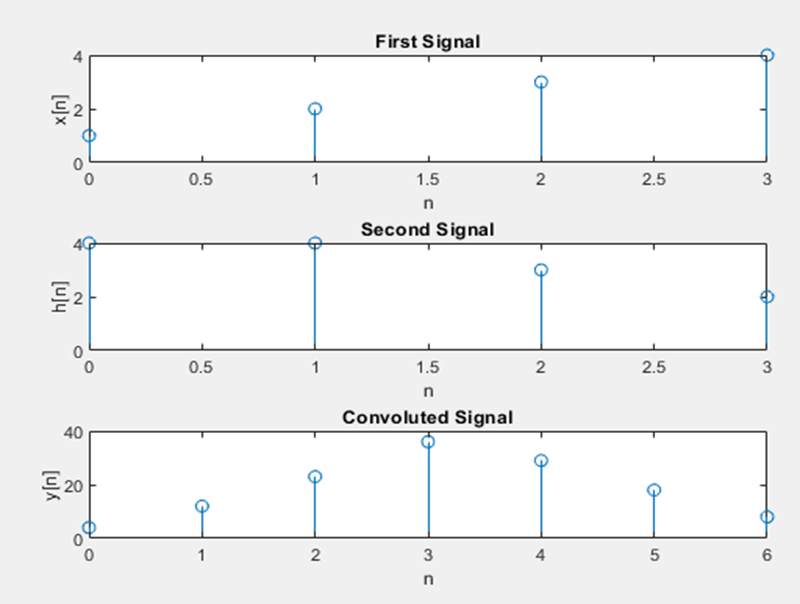
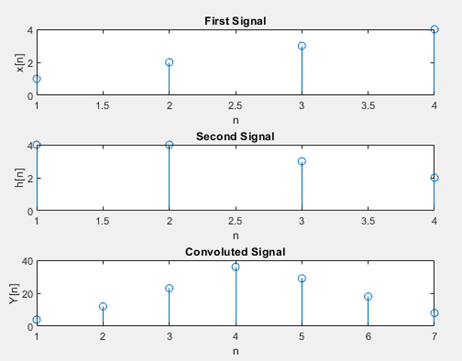

**Experiment No.:** 01

**Experiment Name:** Convolution of two signals i) using conv function and ii) without using conv function

**Experiment Date:** 19.03.2023

**Theory:** When speaking purely mathematically, convolution is the process by which one may compute the overlap of two graphs. In fact, convolution is also interpreted as the area shared by the two graphs over time. Metaphorically, it is a blend between the two functions as one passes over the other. So, given two functions x(n) and h(n), the convolution of the two is expressed and given by the following mathematical expression:
		y(n) = ∑ x(n)*h(n-k)      for k = - ∞ to + ∞

So, clearly intuitive as it looks, we must account for TIME. Convolution involves functions that blend over time. This is introduced in the expression using the time shift i.e., g(t-u) is g(t) shifted to the right ‘u’ times). Additionally, how we characterize this time is also important. Before proceeding further, let us compile the prerequisites involved:
    •Functions: Mathematically, we look at functions or graphs. However, it is important to note that the practical equivalent here is a Signal. We deal with the convolution of 2 signals.

    •LTI Systems: Linear Time-Invariant Systems are systems or processes which produce a Linear and a Time-Invariant output i.e., the output satisfies Linearity (superposition rule) and does not change with time. Convolution is the relation between the input and output of an LTI system.
    
    •Impulse Response: An impulse response is what you usually get if the system in consideration is subjected to a short-duration time-domain signal. Different LTI systems have different impulse responses.
    
    •Time System: We may use Continuous-Time signals or Discrete-Time signals. It is assumed the difference is known and understood to readers. Convolution may be defined for CT and DT signals.

**Linear Convolution:** Linear Convolution is a means by which one may relate the output and input of an LTI system given the system’s impulse response. Clearly, it is required to convolve the input signal with the impulse response of the system. Using the expression earlier, the following equation can be formed-
		y(n) = ∑ x(n)*h(n-k)      for k = - ∞ to + ∞

The reason why the expression is summed an infinite number of times is just to ensure that the probability of the two functions overlapping is 1. The impulse response is time-shifted endlessly so that during some duration of time, the two functions will certainly overlap. It may seem it would be careless on behalf of the programmer to run an infinite loop – the code may continue to execute for as long as the two functions do not overlap.
The solution lies in the fact LTI systems are being used. Since the functions do not change their values/shape over time (time-invariant), they can simply be slid closer to each other.

**Code:**

**Using Conv function:**

```
clc;
clear all;
 x = [ 1 2 3 4];
 h = [ 4 4 3 2];
 
 subplot( 3, 1, 1);
 t = 0 :length(x)-1; 
 stem( t, x);
 xlabel('n');
 ylabel('x[n]');
 title('First Signal');

 
 subplot( 3, 1, 2);
 t = 0:length(h)-1;
 stem( t, h);
 xlabel('n');
 ylabel('h[n]');
 title('Second Signal');
 
 y = conv( x, h);
 
 subplot( 3, 1, 3);
 t = 0 : length(y)-1;
 stem( t, y);
 xlabel('n');
 ylabel('y[n]');
 title('Convoluted Signal');

```

**Without Using Conv function:**
```

clc;
clear all;

x = [ 1 2 3 4];

h = [ 4 4 3 2];

m=length(x);
l=length(h);
X=[x,zeros(1,l)];
H=[h,zeros(1,m)];

z=[];
for i=1:m
    g=h.*x(i);
    z=[z;g];
end

[r c] = size(z);
k = r+c;
t =2;

Y =[];
cd =0;

while(t<=k)
    for i=1:r
        for j=1:c
            if((i+j)==t)
                cd = cd+ z(i,j);
            end
        end
    end
    t = t+1;
    Y = [Y cd];
    cd =0;
end

subplot(3,1,1); stem(x); xlabel('n');
ylabel('x[n]'); title('First Signal');

subplot(3,1,2); stem(h); xlabel('n');
ylabel('h[n]'); title('Second Signal');

subplot(3,1,3); stem(Y); xlabel('n');
ylabel('Y[n]'); title('Convoluted Signal');

```

**Input Output:**



**Fig. 1:** Convolution of two signals using conv function



**Fig. 2:** Convolution of two signals without using conv function

**Discussion & Conclusion:** Firstly we convolute two signals using matlab built-in conv function then convolute same signals without using the conv function. From the above figures, we can see that both the code give the same result.
