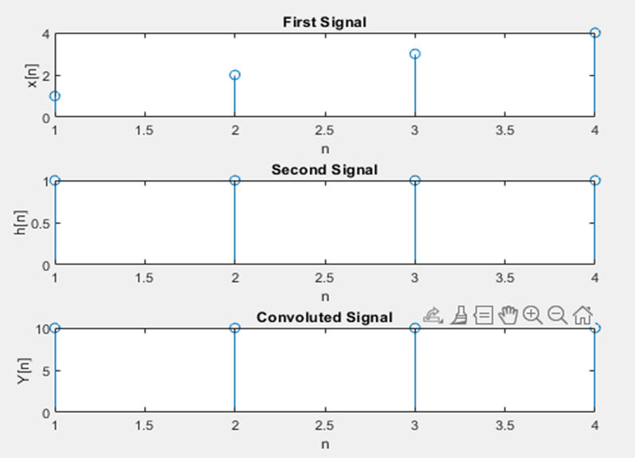
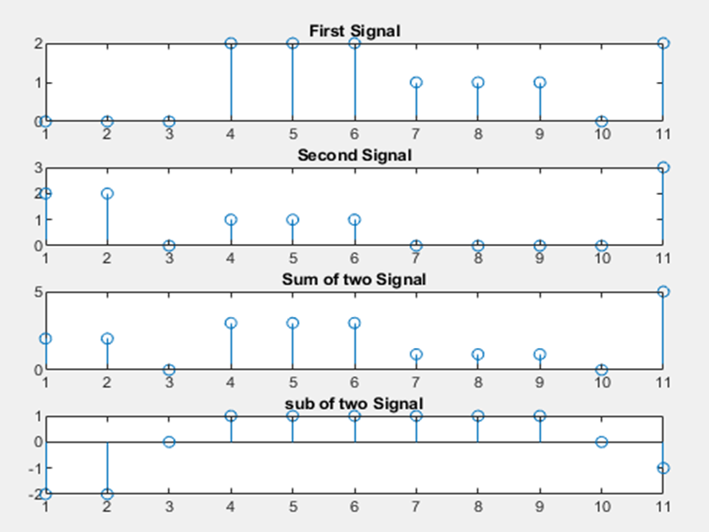
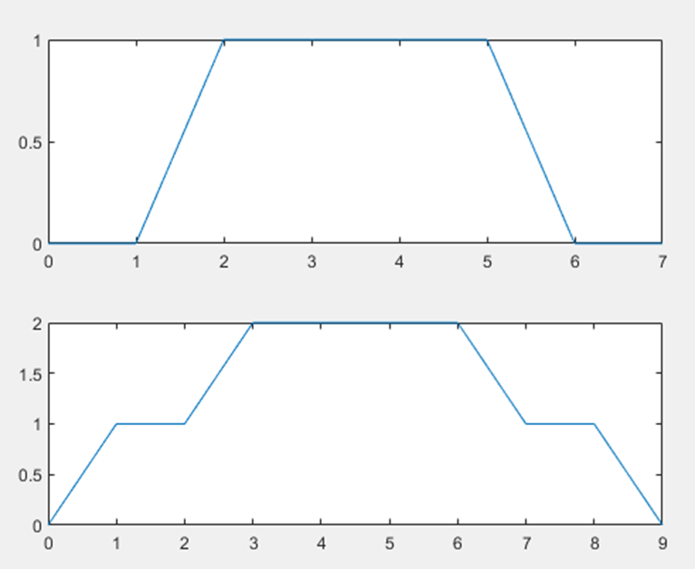

**Experiment No.:** 02

**Experiment Name:** Circular convolution of two signals, adding and subtracting of  two discrete signals and drawing two given signals in Matlab

**Experiment Date:** 03.05.2023

**Theory:** Circular convolution, also known as cyclic convolution, is a special case of periodic convolution, which is the convolution of two periodic functions that have the same period. Periodic convolution arises, for example, in the context of the discrete-time Fourier transform (DTFT). In particular, the DTFT of the product of two discrete sequences is the periodic convolution of the DTFTs of the individual sequences. And each DTFT is a periodic summation of a continuous Fourier transform function. Although DTFTs are usually continuous functions of frequency, the concepts of periodic and circular convolution are also directly applicable to discrete sequences of data. In that context, circular convolution plays an important role in maximizing the efficiency of a certain kind of common filtering operation. Mathematically,
		y(n) = ∑ x(n)*h(n-k)      for k = - ∞ to + ∞


**Code:**

**Circular Convolution:**

```
clc;
clear all;
xn = [1 2 3 4];
hn = [1 1 1 1];

n1 = length(xn);
n2 = length(hn);
n = max(n1,n2);

if(n1>n2)
    hn = [hn, zeros(1,n-n2)];
else
    xn = [xn, zeros(1,n-n1)];
end
y = zeros(1,n);

for i=0:n-1
    for j=0:n-1
        z = mod(i-j,n)
        y(i+1) = y(i+1)+xn(j+1).*hn(z+1)
    end
end

subplot(3,1,1); stem(xn); xlabel('n');
ylabel('x[n]'); title('First Signal');

subplot(3,1,2); stem(hn); xlabel('n');
ylabel('h[n]'); title('Second Signal');

subplot(3,1,3); stem(y); xlabel('n');
ylabel('Y[n]'); title('Convoluted Signal');

```

**Adding and subtracting two signals:**
```

clc;
clear all;

n1 = [0 0 0 2 2 2 1 1 1 0 2];
n2 = [2 2 0 1 1 1 0 0 0 0 3];

subplot(411);
stem(n1);title('First Signal');

subplot(412);
stem(n2);title('Second Signal');

n3 = n1 + n2;

subplot(413);
stem(n3);title('Sum of two Signal');

n4 = n1 - n2

subplot(414);
stem(n4);title('sub of two Signal');

```

**Draw two given signals:**

```
x1 = [0 0 1 1 1 1 0 0];
t = 0:1:7;

subplot(211);
plot(t,x1);


x2 = [0 1 1 2 2 2 2 1 1 0];
t = 0:1:9;

subplot(212)
plot(t,x2);

```

**Input Output:**



**Fig. 1:** Circular Convolution of two signals



**Fig. 2:** Summation and Subtraction of two signals



**Fig. 3:** Draw two given signals

**Discussion & Conclusion:** Firstly, we circularly convolute two signals then adding and subtracting two discrete signals and lastly we draw two signals which were given in the question.
Circular convolution has some limitations. One limitation is that it assumes the input signals are periodic, which may not always be the case in real-world applications. In addition, circular convolution can introduce artifacts such as aliasing, which can degrade the quality of the output signal. To mitigate these issues, various techniques such as windowing and overlap-add methods can be used. 
