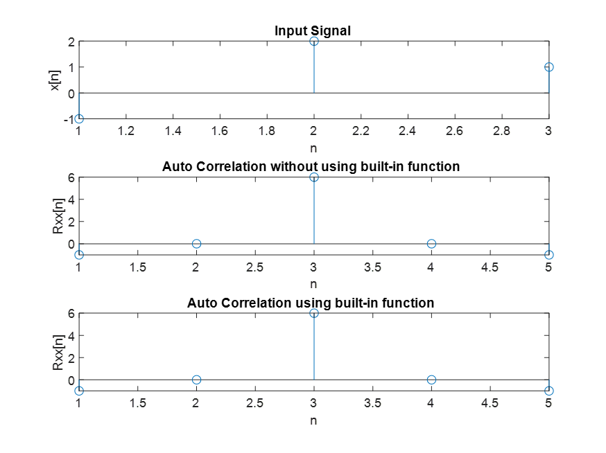
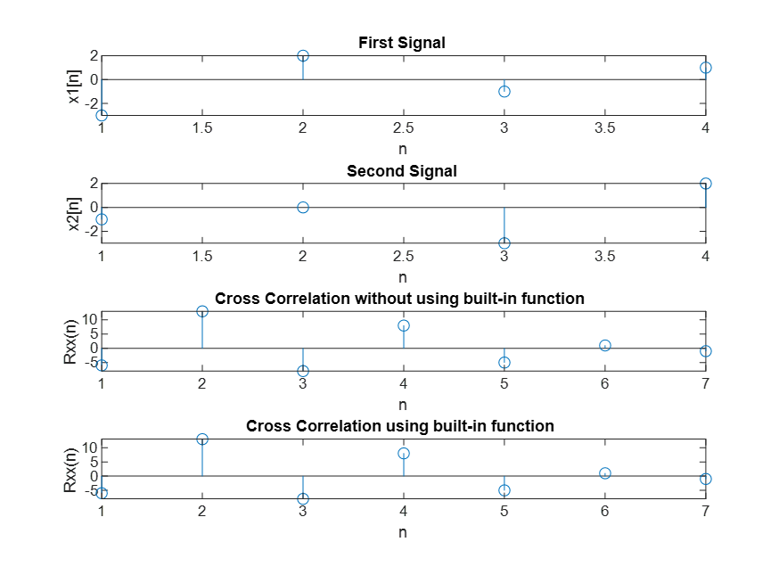

**Experiment No.:** 03

**Experiment Name:** Auto-correlation of a signal and Cross-correlation of two signals

**Experiment Date:** 08.05.2023

**Theory:** In general, correlation describes the mutual relationship which exists between two or more things. The same definition holds good even in the case of signals. That is, correlation between signals indicates the measure up to which the given signal resembles another signal.
In other words, if we want to know how much similarity exists between the signals 1 and 2, then we need to find out the correlation of Signal 1 with respect to Signal 2 or vice versa.
Depending on whether the signals considered for correlation are same or different, we have two kinds of correlation: autocorrelation and cross-correlation.

**Auto Correlation:**
This is a type of correlation in which the given signal is correlated with itself, usually the time-shifted version of itself. Mathematical expression for the autocorrelation of continuous-time signal x (t) is given by,

			Rxx(τ)=∫ x(t)x’(t−τ)dt for t=-∞ to t= +∞
where ‘ denotes the complex conjugate.

Similarly the autocorrelation of the discrete time signal x[n] is expressed as
			Rxx[m]=∑x[n]x’[n−m]  for n=-∞ to n=+∞

**Cross-Correlation:**
This is a kind of correlation, in which the signal in-hand is correlated with another signal so as to know how much resemblance exists between them. Mathematical expression for the cross-correlation of continuous-time signals x (t) and y (t) is given by
		Rxy(τ)=∫x(t)y’(t−τ)dt for t=-∞ to t= +∞
where ‘ denotes the complex conjugate.

Similarly, the cross-correlation of the discrete time signals x [n] and y [n] is expressed as
		Rxy[m]=∑x[n]y’[n−m] for n=-∞ to n=+∞


**Code:**

**Auto-correlation:**

```
clc;
clear all;
x = [-1, 2, 1]; 
%x = input('Give input signal : ');
l = length(x);

x1 = [zeros(1,l-1),x, zeros(1,l-1)];
N = length(x1);
x2 = [x, zeros(1,N-l)];
rxx = zeros(1, 2*l-1); 
for i=1:2*l-1
    for j=1:2*l-1
        rxx(i)=rxx(i)+x1(j)*x2(j);
    end
    x2 = circshift(x2,1);
end

rxx0 = xcorr(x);

subplot(3,1,1); stem(x); xlabel('n');
ylabel('x[n]'); title('Input Signal');

subplot(3,1,2); stem(rxx); xlabel('n');
ylabel('Rxx[n]'); title('Auto Correlation without using built-in function');

subplot(3,1,3); stem(rxx0); xlabel('n');
ylabel('Rxx[n]'); title('Auto Correlation using built-in function');

```

**Cross-correlation:**
```
clc;
clear all;
%x11 = [-3, 2, -1, 1]; 
x11 = input('1st sequence : ');
l = length(x11);


%x22 = [-1, 0, -3, 2];
x12 = input('2nd sequence : ');
m= length(x22);

x1 = [zeros(1,l-1),x11, zeros(1,l-1)];
N = length(x1);
x2 = [x22, zeros(1,N-l)];
rxx = zeros(1, 2*l-1); 
for i=1:2*l-1
    for j=1:2*l-1
        rxx(i)=rxx(i)+x1(j)*x2(j);
    end
    x2 = circshift(x2,1);
end

rxx0 = xcorr(x11,x22);

subplot(4,1,1); stem(x11); xlabel('n');
ylabel('x1[n]'); title('First Signal');

subplot(4,1,2); stem(x22); xlabel('n');
ylabel('x2[n]'); title('Second Signal');

subplot(4,1,3); stem(rxx); xlabel('n');
ylabel('Rxx(n)'); title('Cross Correlation without using built-in function');

subplot(4,1,4); stem(rxx0); xlabel('n');
ylabel('Rxx(n)'); title('Cross Correlation using built-in function');


```

**Input Output:**



**Fig. 1:** Auto-correlation of a signal



**Fig. 2:** Cross-Correlation of two signals

**Discussion & Conclusion:** In this experiment, we perform auto-correlation of a signals. Firstly we use built in function to calculate auto correlation and then we calculate auto-correlation without built in function. From the graph we can see that, the two output with or without built in function is similar.
Then we also perform cross-correlation of two signals. Here also we calculate cross correlation with and without built in function. And here also the two output is similar.
