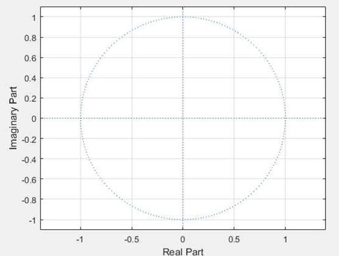

**Experiment No.:** 05

**Experiment Name:** Z-transform, zeroes, poles & ROC of Causal, Anti-causal, and Non-causal signal

**Experiment Date:** 22.05.2023

**Theory:** Casual Signal: In the context of the Z-transform, a causal signal is a sequence that is nonzero only for nonnegative indices or time instances. It is also as right handed signal. The Z-transform of a right-sided signal can be computed using the definition of the Z-transform.
The general formula for the Z-transform of a right-sided signal x[n] is:
             X(z) = ∑x[n] * z^(-n), for n = 0 to infinity

**Anti-causal Signal:** In the context of the Z-transform, a anti-causal signal is a sequence that is nonzero only for negative indices or time instances. It is also called as left handed signal. The Z-transform of a left-sided signal can be computed using the definition of the Z-transform.
The general formula for the Z-transform of a left-sided signal x[n] is:
             X(z) = ∑x[n] * z^(-n), for n = -infinity to -1

**Non-Causal Signal:** Non-causal signal in the context of the Z-transform refers to a sequence that has nonzero values for both positive and negative indices or time instances. The Z-transform of a non-causal signal can still be computed using the definition of the Z-transform.
The general formula for the Z-transform of a non-causal signal x[n] is:
            X(z) = ∑x[n] * z^(-n), for all values of n

**Code:**

**Code of Causal Signal:**

```
clc;
clear all;
x=[1 2 3 4 5]
b=0;
n=length(x);
y=sym('z');
for i=1:n
    b=b+x(i)*y^(1-i);
end
display(b)

z=[];
p=[0]
zplane(z,p)

```

**Code of Anti Causal signal:**
```
clc;
clear all;
 
x=[1 2 3 4 5]
b=0;
n=length(x);
y=sym('z');
for i=1:n
    b=b+x(i)*y^(i-1);
end
display(b)
z=[];
p=[]
zplane(z,p)

```

**Code of Non Causal signal:**
```
clc;
clear all;
 
x=[1 2 3 4 5]
value=3;
index=find(x==value);
disp(index);
 
 
b=0;
n=length(x);
y=sym('z');
for i=1:n
    b=b+x(i)*y^(index-i);
end
display(b)

z=[];
p=[0]
zplane(z,p)
grid

```

**Input Output:**


**Fig. 1:** Output of Causal Signal


**Fig. 2:** Zeros and Poles of Causal Signal


**Fig. 3:** Output of anti-causal Signal



**Fig. 4:** Zeros and Poles of anti-causal Signal


**Fig. 5:** Output of non-causal Signal


**Fig. 6:** Zeros and Poles of non-causal Signal

**Discussion:** In this experiment, we learnt about some signal like causal signal, anti causal signal and non causal signal. We saw the basic differences of these signals. A causal signal is a sequence that is nonzero only for nonnegative indices or time instances. The Z-transform of a causal signal is typically a rational function with a region of convergence (ROC) that includes the unit circle. An anti-causal signal is a sequence that is nonzero only for negative indices or time instances. The Z-transform of an anti-causal signal is typically a rational function with a region of convergence (ROC) that includes the exterior of the unit circle. A non-causal signal is a sequence that has nonzero values for both positive and negative indices or time instances. The Z-transform of a non-causal signal can still be computed, but the resulting expression may not be a rational function, and the ROC may be a ring or annulus in the Z-plane. We implemented the code for causal, anti causal, non-causal and finally we saw the poles and zeros of different signals.

**Conclusion:** We successfully completed the task as we got the exactly same result which we learnt from the theory.

